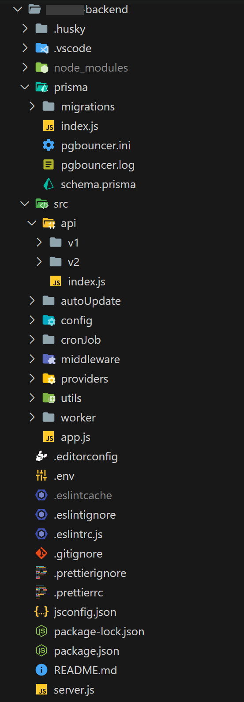

# Folder Structure

`:::
ignore the icons 😅 
:::`

```
.
└── 📦 project ( root )
    ├── prisma 💻
    │   ├── schema.prisma
    │   ├── index.js
    │   └── migrations
    ├── src
    │   ├── api 🧩
    │   │   ├── v1
    │   │   │   ├── controllers
    │   │   │   │   ├── user.js
    │   │   │   │   ├── admin.js
    │   │   │   │   └── ...other
    │   │   │   ├── handlers
    │   │   │   │   ├── user.js
    │   │   │   │   ├── admin.js
    │   │   │   │   └── ...other
    │   │   │   ├── swagger 📖
    │   │   │   │   ├── user.json
    │   │   │   │   ├── admin.json
    │   │   │   │   └── index.js
    │   │   │   └── index.js
    │   │   └── index.js
    │   ├── config 🍀
    │   ├── middleware 👾
    │   │   ├── auth.js
    │   │   ├── permit.js
    │   │   ├── error.js
    │   │   ├── logger.js
    │   │   └── ...other
    │   ├── providers 📩
    │   │   ├── email
    │   │   │   ├── index.js
    │   │   │   └── templates.js
    │   │   └── sms
    │   │       └── index.js
    │   ├── utils ⚒️
    │   │   ├── index.js
    │   │   ├── aws.js
    │   │   ├── jwt.js
    │   │   └── query-helper.js
    │   └── app.js
    ├── .editorconfig
    ├── .env 🗝️
    ├── .eslintignore
    ├── .eslintrc.js
    ├── .gitignore
    ├── .prettierignore
    ├── .prettierrc
    ├── jsconfig.json
    ├── package.json
    └── server.js ⚡
```

### Example Project Folder Structure

